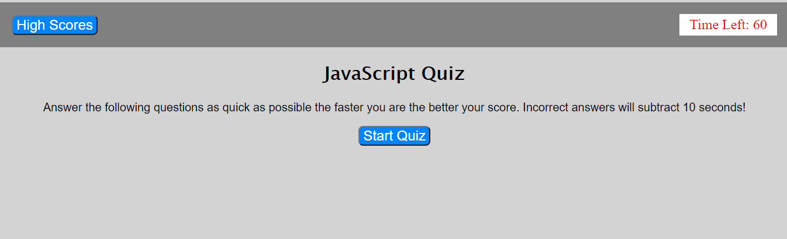

# Simple JavaScript Quiz

*[General Info](#General-Info)
*[Technology](#Technology)
*[Setup](#Setup)
*[Preview](#Preview)

## General Info
This is a simple Quiz with questions about Javascript coding.
* 60 Second Time Limit
* Incorrect answers deduct 10 seconds
* Ability to add 3 letter initials to a high score list upon completion
* Scores are persistent during attempts but reset on a page refresh

## Technologies
Page was created using
*HTML
*CSS
*Javascript

## Setup
Page can be viewed at https://krispywing.github.io/code-quiz

## Preview
